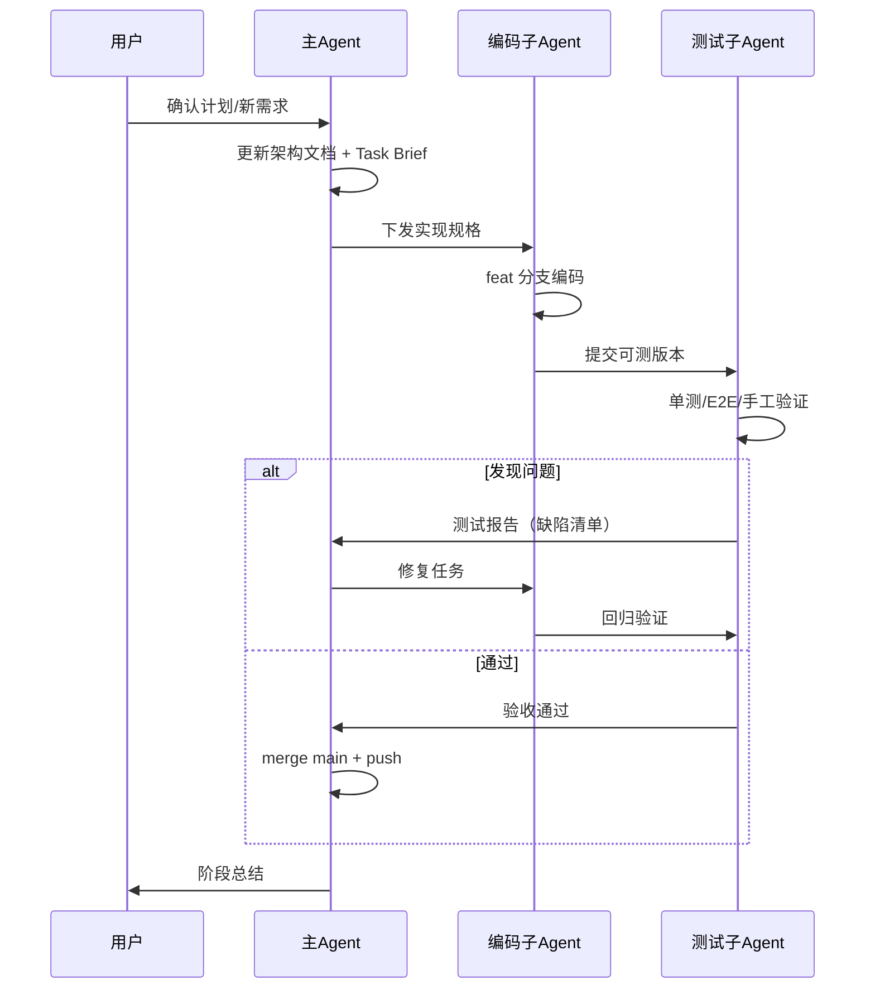

# 多 Agent 协作流程

本文档描述 frontend-observability 项目的多 Agent 开发工作流。

## 流程总览

## 本项目的执行记录

| 步骤 | 分支 | 编码 Agent | 测试 Agent | 状态 |
|------|------|-----------|-----------|------|
| 01 脚手架 | `feat/01-scaffold` | 主 Agent | - | 完成 |
| 02 SDK 核心 | `feat/02-sdk-core` | 编码子 Agent | 测试子 Agent | 完成 |
| 03 错误采集 | `feat/03-error-plugin` | 编码子 Agent | 测试子 Agent | 完成 |
| 04 性能监控 | `feat/04-performance` | 编码子 Agent | 测试子 Agent | 完成 |
| 05 会话回放 | `feat/05-rrweb` | 编码子 Agent | 测试子 Agent | 完成 |
| 06 后端服务 | `feat/06-server` | 编码子 Agent | 测试子 Agent | 完成 |
| 07 管理后台 | `feat/07-dashboard` | 编码子 Agent | 测试子 Agent | 完成 |
| 08 演示/E2E | `feat/08-demo-e2e` | 编码+测试子 Agent | 测试子 Agent | 完成 |

## 每步标准流程

### 1. 主 Agent：规划

- 创建 `docs/task-briefs/step-XX.md`
- 从 `main` 切出 `feat/XX-xxx` 分支
- 明确接口契约与验收标准

### 2. 编码子 Agent：实现

- 仅在指定分支工作
- 中文注释
- 本地 `build` + 单元测试通过
- 不修改契约外的 API

### 3. 测试子 Agent：验收

- 运行相关测试套件
- 输出 `docs/test-reports/step-XX.md`
- 标记 PASS / FAIL

### 4. 主 Agent：合并

- FAIL → 下发修复任务，回到步骤 2
- PASS → `git merge --no-ff feat/XX-xxx` → `git push`

## 测试子 Agent 验收清单

### Step 03 错误监控

- [ ] SDK 捕获 `throw new Error()`
- [ ] Promise rejection 可捕获
- [ ] Vue errorHandler 生效
- [ ] 后端入库成功
- [ ] Dashboard 错误列表可见

### Step 04 性能监控

- [ ] LCP/INP/CLS 事件上报
- [ ] 长任务事件上报
- [ ] `/api/performance/summary` 返回分位数

### Step 05 会话回放

- [ ] rrweb 环形缓冲正常工作
- [ ] 错误触发后 REPLAY 事件上报
- [ ] Dashboard 回放页面可播放

### Step 08 E2E 全链路

- [ ] Playwright 3/3 通过
- [ ] demo 站点可触发错误并被 API 接收

## 缺陷流转

测试子 Agent 发现缺陷后，在报告中按优先级标注：

| 级别 | 说明 | 处理时效 |
|------|------|----------|
| P0 | 阻塞发布（服务不可用） | 立即修复 |
| P1 | 核心功能异常 | 当步修复 |
| P2 | 非核心问题 | 可延后 |

主 Agent 将 P0/P1 缺陷转化为编码子 Agent 的修复 Brief，包含：

- 缺陷 ID 与复现步骤
- 根因分析（如有）
- 建议修复范围
- 回归验证项
