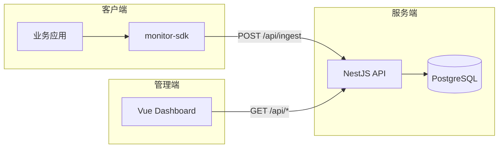
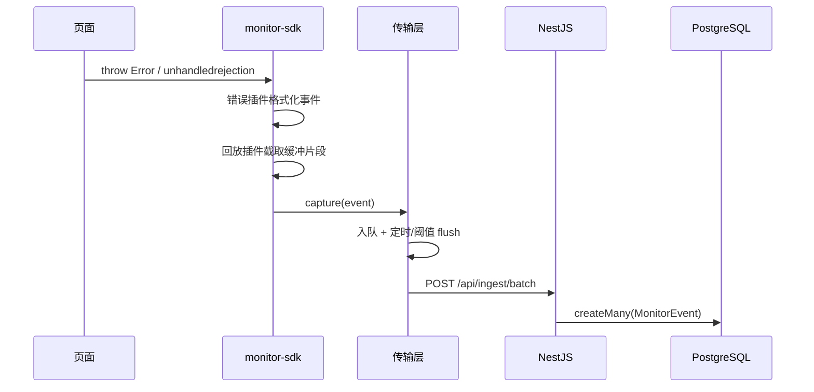
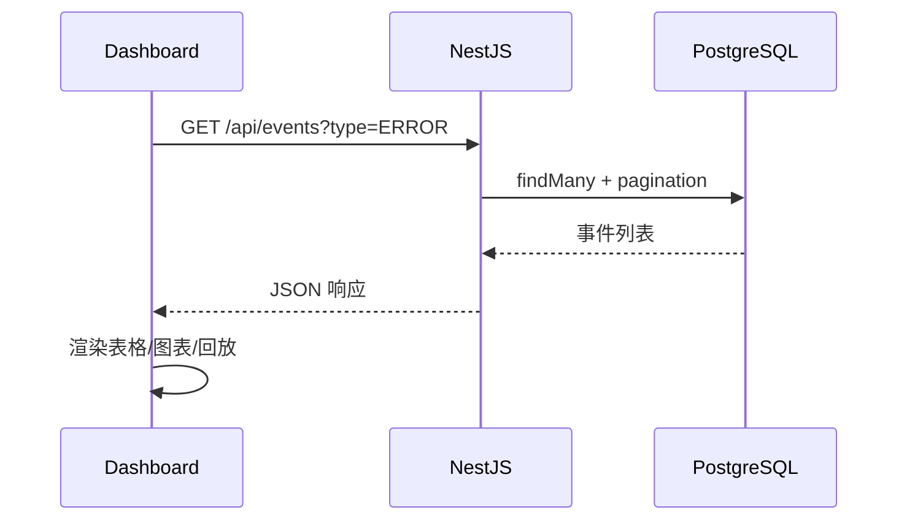

# 系统架构设计

## 1. 总体架构

frontend-observability 采用 **Monorepo** 组织，分为四个运行时模块：



## 2. 模块划分

### 2.1 SDK (`packages/sdk`)

浏览器端采集库，采用 **插件化架构**：

| 插件 | 文件 | 职责 |
|------|------|------|
| 传输层 | `core/transport.ts` | 事件队列、批量上报、失败重试、sendBeacon 降级 |
| 会话 | `core/session.ts` | sessionId 生成与 sessionStorage 持久化 |
| 错误 | `plugins/error.ts` | `window.onerror`、`unhandledrejection`、资源加载错误 |
| Vue | `plugins/vue.ts` | `app.config.errorHandler` 适配 |
| 性能 | `plugins/performance.ts` | Web Vitals（LCP/INP/CLS）、长任务 PerformanceObserver |
| 回放 | `plugins/replay.ts` | rrweb 录制 + 时间窗口环形缓冲 |
| 面包屑 | `plugins/breadcrumb.ts` | 点击、路由、XHR 摘要 |

**初始化流程：**

1. 解析并合并默认配置
2. 创建 Transport 实例（绑定 dsn、appKey）
3. 按配置依次注册插件
4. 插件通过 `monitor.capture()` 将事件送入 Transport 队列

### 2.2 上报服务 (`packages/server`)

NestJS 模块化后端：

| 模块 | 路由前缀 | 职责 |
|------|----------|------|
| IngestModule | `/api/ingest` | SDK 批量上报，appKey 鉴权 |
| EventsModule | `/api/events` | 事件分页查询与详情 |
| PerformanceModule | `/api/performance` | 性能指标聚合（P50/P75/P95） |
| ProjectsModule | `/api/projects` | 项目管理 CRUD |

数据访问层使用 **Prisma ORM**，数据库为 **PostgreSQL**。

### 2.3 管理后台 (`packages/dashboard`)

Vue3 + Element Plus SPA：

- **错误中心** — 列表筛选、堆栈展示、面包屑时间线
- **性能看板** — ECharts 展示 Web Vitals 分位数
- **会话回放** — rrweb-player 播放器
- **项目管理** — appKey 生成与复制

### 2.4 演示应用 (`apps/demo`)

用于验证 SDK 集成的最小 Vue 应用，提供手动触发错误的按钮。

## 3. 数据流

### 3.1 错误上报流



### 3.2 查询展示流



## 4. rrweb 回放策略

为避免全量录制带来的体积与隐私问题，采用 **环形缓冲 + 异常触发切片** 策略：

1. **持续录制**：rrweb `record()` 启动后，所有 event 带 timestamp 写入内存数组
2. **环形淘汰**：仅保留最近 `bufferSeconds`（默认 30s）内的事件
3. **触发上报**：错误/性能异常发生时：
   - 取出当前缓冲区内所有事件
   - 继续录制 `postTriggerSeconds`（默认 5s）后的事件
   - 合并为 REPLAY 类型事件上报
4. **隐私保护**：默认 `maskAllInputs: true`，可配置 `maskSelectors` / `blockSelectors`

## 5. 数据模型

```prisma
model Project {
  id        String   @id
  name      String
  appKey    String   @unique
  events    MonitorEvent[]
}

model MonitorEvent {
  id        String    @id
  projectId String
  type      EventType  // ERROR | PERFORMANCE | REPLAY
  payload   Json       // 事件详情（堆栈、指标、rrweb events 等）
  sessionId String?
  url       String?
  userAgent String?
  createdAt DateTime
}
```

错误事件的 `payload` 结构示例：

```json
{
  "message": "Cannot read property 'x' of undefined",
  "stack": "Error: ...\n    at ...",
  "breadcrumbs": [
    { "category": "click", "message": "button#submit", "timestamp": 1718000000000 }
  ]
}
```

## 6. 安全考量

- **鉴权**：SDK 上报需携带 `X-App-Key` 请求头
- **体积极限**：服务端限制请求体大小（默认 10MB）
- **脱敏**：输入框默认遮蔽；XHR 面包屑仅记录 URL/方法/状态码，不含 body
- **采样**：SDK 端 `sampleRate` 控制上报比例

## 7. 技术选型理由

| 选型 | 理由 |
|------|------|
| TypeScript 全栈 | 类型安全，SDK 与 Server 共享类型约定 |
| NestJS | 模块化、依赖注入，适合 API 服务 |
| Prisma + PostgreSQL | 结构化事件存储 + JSON 字段灵活性 |
| rrweb | 成熟的 DOM 回放方案 |
| Vue3 + Element Plus | 快速搭建管理后台 |
| Playwright | E2E 全链路验证 |
